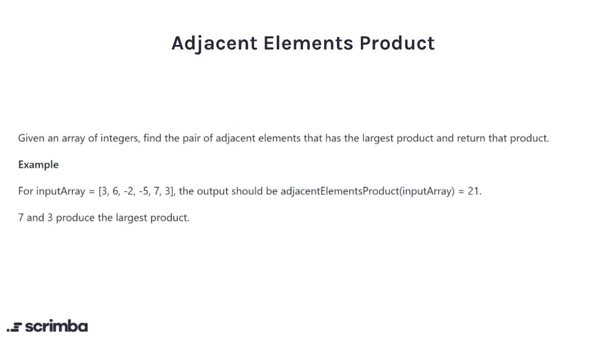

## Problem

https://scrimba.com/learn/adventcalendar/-javascript-challenge-adjacent-elements-product-introduction-c8q4NRCE



## Solution

```javascript
function adjacentElementsProduct(nums) {
    let largestProduct = nums[0]
    for (let i = 0; i < nums.length - 1; i++){
        const product = nums[i] * nums[i+1]
        if(product > largestProduct){
            largestProduct = product
        } 
    }
    return largestProduct;
}
```