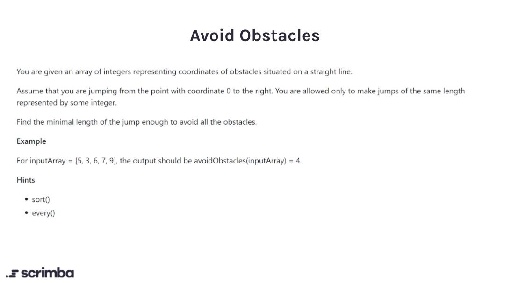

## Problem

https://scrimba.com/learn/adventcalendar/-javascript-challenge-avoid-obstacles-introduction-crGrJPTm



## Solution

```javascript
function avoidObstacles(nums) {
    const sortedArray = nums.sort((a,b)=> a - b)
    let isMinLengthFound = false
    let minLength = 1
    while(isMinLengthFound == false){
        minLength = minLength + 1
        isMinLengthFound = sortedArray.every((elem) => {
            return elem % minLength != 0
        })
    }
    return minLength
}
```