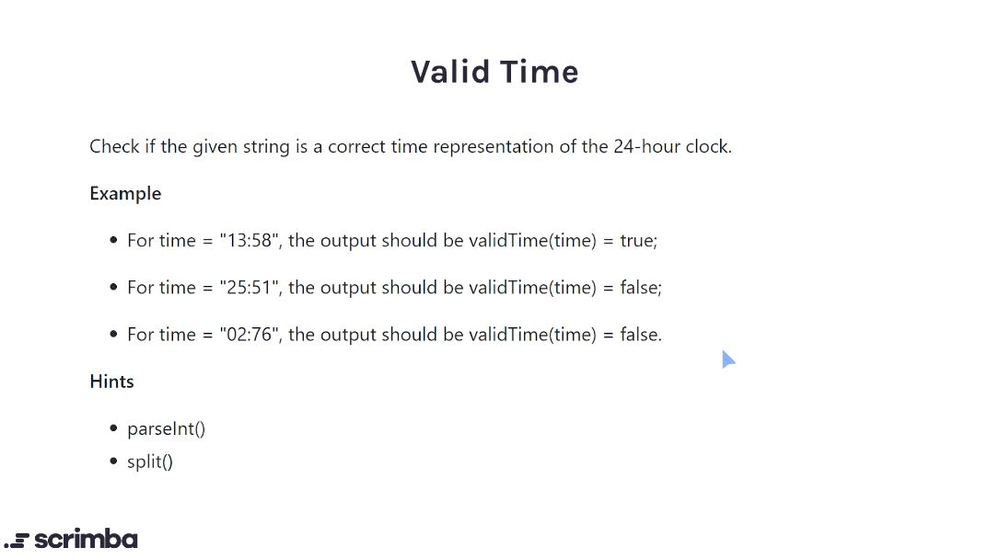

## Problem

https://scrimba.com/learn/adventcalendar/-javascript-challenge-valid-time-introduction-cLkq4bSQ



## Solution

```javascript
function validTime(str) {
    // Array Destructured Assignment
    let [hours, mins] = str.split(":");
    hours = parseInt(hours);
    mins = parseInt(mins);
    
    if (hours > 24 || hours < 0  || mins > 59 || mins < 0) {
        return false
    }
    return true;
}
```


