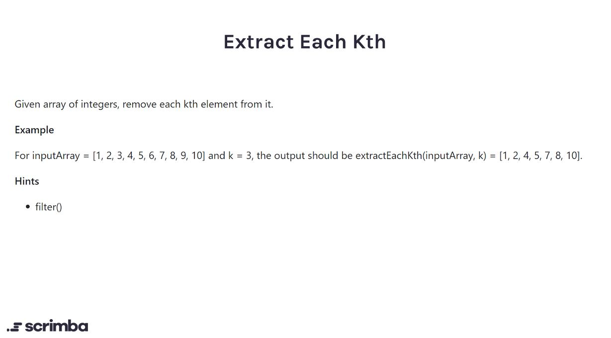

## Problem

https://scrimba.com/learn/adventcalendar/-javascript-challenge-extract-each-kth-introduction-ce96GEHP



## Solution

```javascript
function extractEachKth(nums, index) {
    // filter removes the elements 
    // which don't fulfill the boolean condition 
    // in the return statement
    
    // (2 + 1) % 3 is equal to 0
    // Hence the element at 2nd index (3rd element)
    // is removed from the array
    const arr = nums.filter((elem, idx) => {
        return (idx + 1) % index != 0
    })
    return arr
}
```

