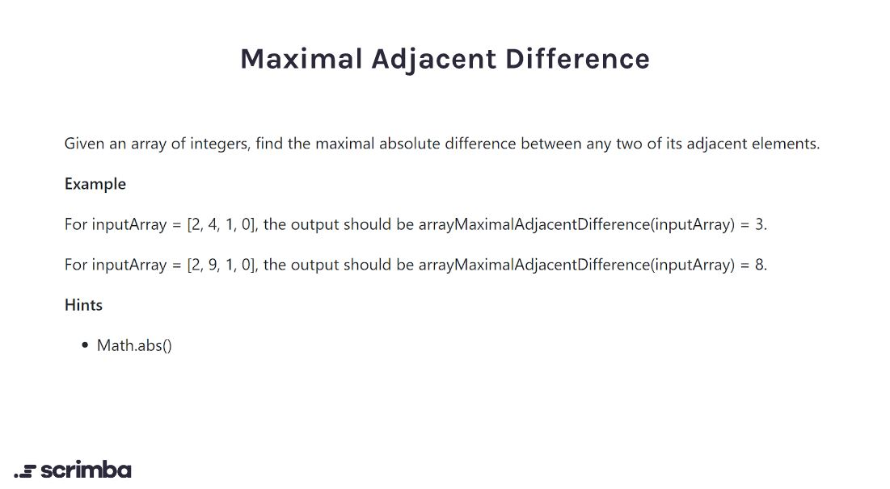

## Problem

https://scrimba.com/learn/adventcalendar/-javascript-challenge-maximal-adjacent-difference-introduction-ckRE4Kt9



## Solution

```javascript
function arrayMaximalAdjacentDifference(nums) {
    let maxDifference = Math.abs(nums[1] - nums[0]);
    for (let i = 0; i < nums.length - 1; i ++){
        const difference = Math.abs(nums[i+1] - nums[i]);
        if (difference > maxDifference) {
            maxDifference = difference;
        }
    }
    return maxDifference;
}
```
