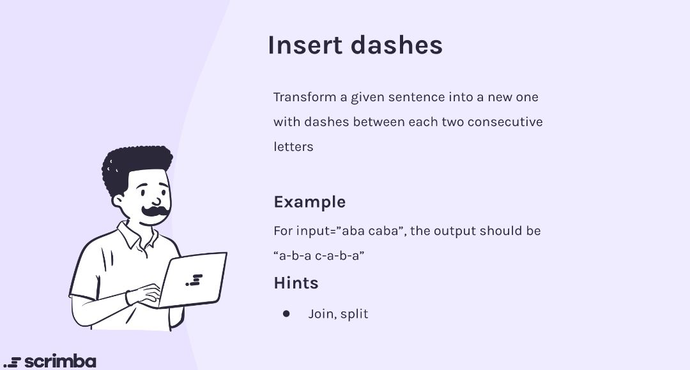

## Problem

https://scrimba.com/learn/adventcalendar/-javascript-challenge-insert-dashes-introduction-co2914310ba38bcaab285ccfa



## Solution

```javascript
function insertDashes(str) {
    arr = str.split(" ")
    arr.forEach((elem, i, array) => {
        array[i] =  elem.split("").join("-")
    })
    return arr.join(" ")
}
```

