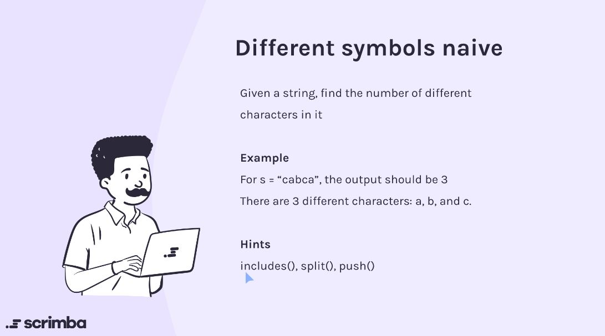

## Problem

https://scrimba.com/learn/adventcalendar/-javascript-challenge-different-symbols-naive-introduction-cocf74b85b168559bf4e75a1a



## Solution

This problem can be solved in quite a different ways. I have demonstrated three ways. 

1. Using Array
2. Using Set
3. Using Map

```javascript
// Using array
function differentSymbolsNaive(str) {
    let arr = []
    for (let s of str){
        if (!arr.includes(s)){
            arr.push(s)
        }
    }
    return arr.length
}

// Using Set
function differentSymbolsNaive(str) {
    let strSet = new Set(str)
    return strSet.size
}

// Using Map
function differentSymbolsNaive(str){
    let strMap = new Map()
    for(let s of str){
        strMap.set(s, 1)
    }
    return strMap.size
}
```

[Set] https://developer.mozilla.org/en-US/docs/Web/JavaScript/Reference/Global_Objects/Set