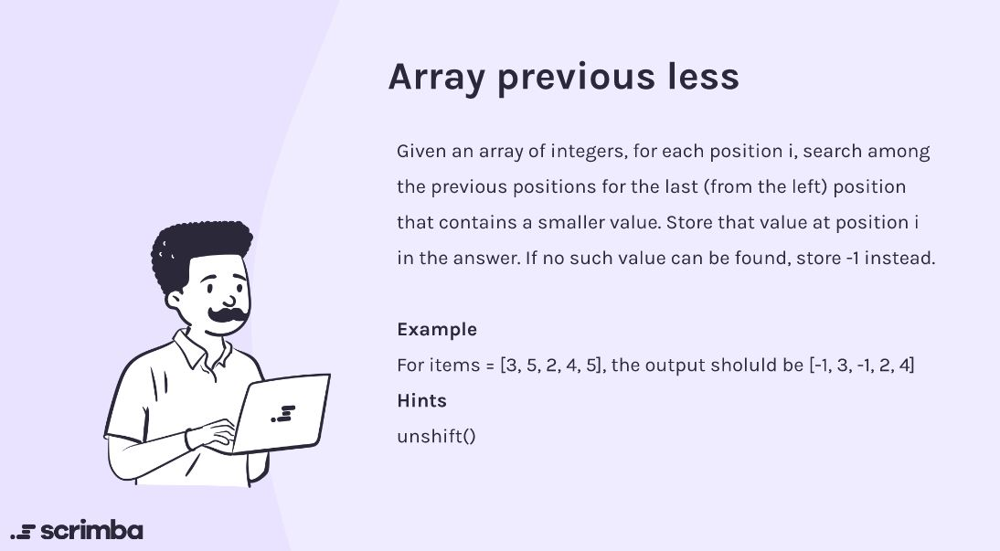

## Problem

https://scrimba.com/learn/adventcalendar/-javascript-challenge-array-previous-less-introduction-co8cd43f5a1ebd5c407f1b3f8



## Solution

```javascript
function arrayPreviousLess(nums) {
    let arr = Array(nums.length).fill(0);
    let b;
    
    for(let i = 0; i < nums.length; i++){
        b = containsSmaller(nums, i);
        if (b == 0){
            arr[i] = -1;
        }
        else {
            arr[i] = b;
        }
    }
    return arr
}
function containsSmaller(nums, index){
    let i = index;
    let found = false;
    // Traversing from `index` to 0th position in the array
    // If an element smaller than the element at current `index`
    // is found then that element is returned 
    // otherwise 0 is returned.
    while(i >= 0 && !found){
        if(nums[i] < nums[index]) {
            found = true
            break
        }
        i -= 1;
    }
    if (!found){
        return 0;
    }
    else{
        return nums[i];
    }
}
```