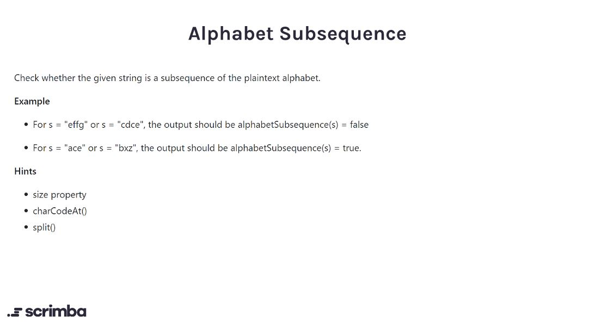

## Problem

https://scrimba.com/learn/adventcalendar/-javascript-challenge-alphabet-subsequence-introduction-czbJ4Jt9



## Solution

```javascript
function alphabetSubsequence(str) {
    // str is split into array of characters
    //  and each character is converted into its UTF-16 equivalent integer
    let arr = str.split("").map((val, index, arr) => {
        return val.charCodeAt(0)
    })
    
    // Traversing the array and checking if each element
    // is smaller than the element one ahead of it.
    for (let i = 0; i < arr.length - 1; i++){
        if (arr[i] >= arr[i+1]){
            return false
        }
    }
    return true
}
```

https://developer.mozilla.org/en-US/docs/Web/JavaScript/Reference/Global_Objects/Array/map

https://developer.mozilla.org/en-US/docs/Web/JavaScript/Reference/Global_Objects/String/charCodeAt