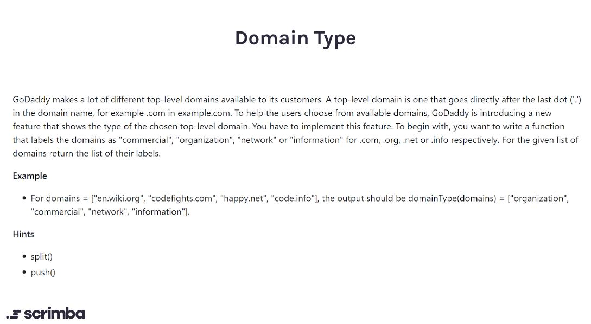

## Problem


https://scrimba.com/learn/adventcalendar/-javascript-challenge-domain-type-introduction-czbwRaH8



## Solution

```javascript
function domainType(domains) {
    let domainTypeMap = new Map(
        [
            ["org", "organization"],
            ["com", "commercial"],
            ["net", "network"],
            ["info", "information"]
        ]
    )
    let domainTypes = domains.map((val) => {
        let arr = val.split(".")
        return domainTypeMap.get(arr[arr.length-1])
    })
    return domainTypes
}
```