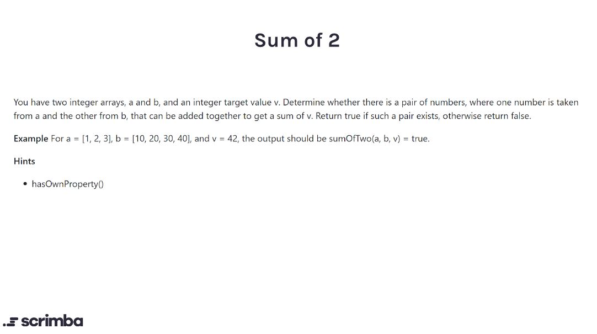

## Problem

https://scrimba.com/learn/adventcalendar/-javascript-challenge-sum-of-two-introduction-cE9B9rfE



## Solution

```javascript
function sumOfTwo(nums1, nums2, value) {
    for (let x of nums1){
        for (let y of nums2){
            if (value = x + y){
                return true
            }
        }
    }
    return false
}
```