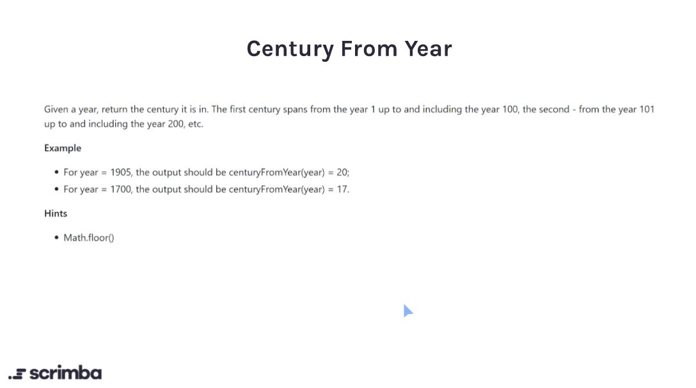

## Problem 



https://scrimba.com/learn/adventcalendar/javascript-challenge-century-from-year-introduction-cNDr7NUB

## Solution

```javascript
function centuryFromYear(num) {
    if (num <= 100) {
        return 1
    }
    if (num % 100 == 0){
        return num / 100
    }
    else {
        return Math.ceil(num / 100)
    }
}
```