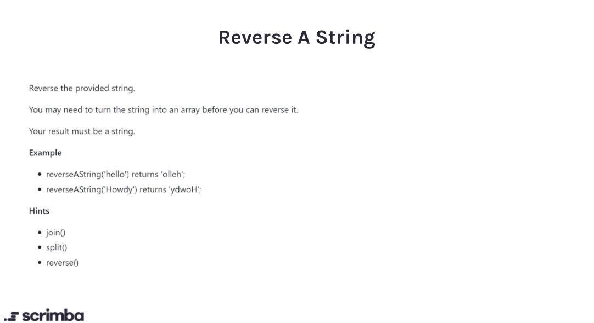

## Problem

https://scrimba.com/learn/adventcalendar/-javascript-challenge-reverse-a-string-introduction-c9rME3fv



## Solution

```javascript
function reverseAString(str) {
    let splitStringArray = str.split("");
    
    let reversedStringArray = splitStringArray.reverse()
    
    let reversedString = reversedStringArray.join("")
    
    return reversedString
}
```

*Or one can chain the methods*
```javascript
function reverseAString(str){
    return str.split("").reverse().join("")
}
```