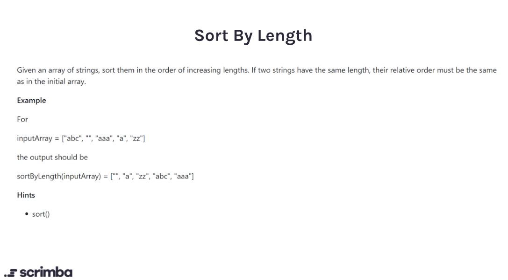

## Problem 

https://scrimba.com/learn/adventcalendar/-javascript-challenge-sort-by-length-introduction-cyw87yuK



## Solution

```javascript
function sortByLength(strs) {
    return strs.sort((a,b) => a.length - b.length);
}
```
