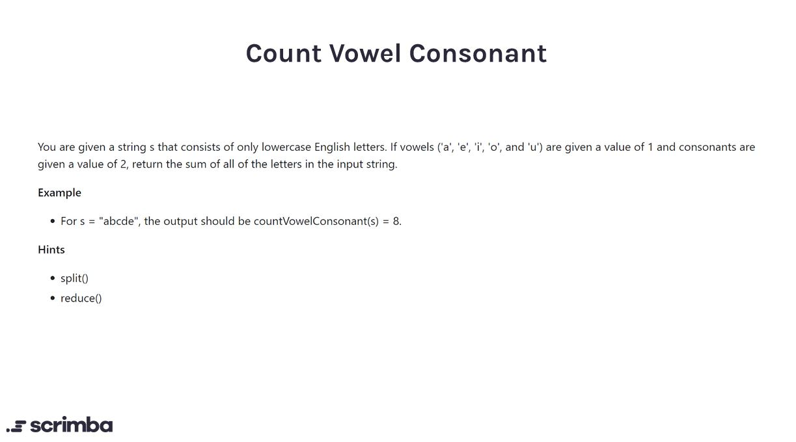

## Problem

https://scrimba.com/learn/adventcalendar/javascript-challenge-count-vowel-consonant-introduction-coa5e49d4b957084837f19509



## Solution

```javascript
function countVowelConsonant(str) {
  const vowels = ["a", "e", "i", "o", "u"]
  const arrayOfLetters = str.split("")
  let sum = 0
  for (let letter of arrayOfLetters){
      if(vowels.includes(letter)){
          sum = sum + 1
      }
      else{
          sum = sum + 2
      }
  }
  return sum
  
}
```