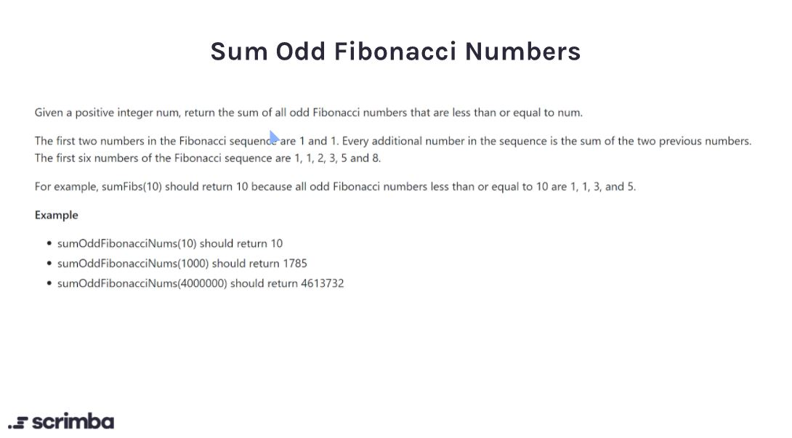

## Problem 

https://scrimba.com/learn/adventcalendar/-javascript-challenge-sum-odd-fibonacci-numbers-introduction-cmpWaRcW



## Solution

**My Solution**

```javascript
function sumOddFibonacciNumbers(num) {
    //  write code here.
    let a = 0;
    let b = 1;
    let sum = 0;
    let temp;
    while(b <= num){
        if (b % 2 != 0){
            sum = sum + b;
        }
        temp = a + b;
        a = b;
        b = temp;
    }
    return sum
}
```

**Scrimba's Solution**

```javascript
function sumOddFibonacciNumbers(num) {
    let sum = 0;
    let previous = 0;
    let current = 1;
    
    while(current <= num) {
        if(current % 2 === 1) {
            sum += current;
        }
        
        const nextValue = current + previous;
        previous = current;
        current = nextValue;
    }
    
    return sum;
}

```